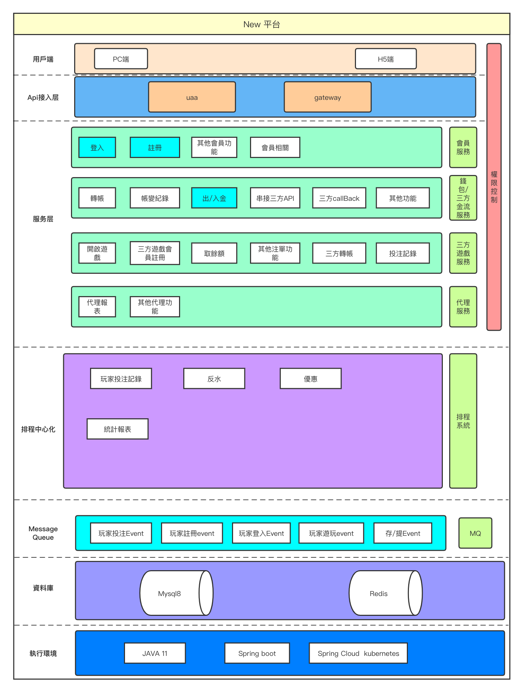
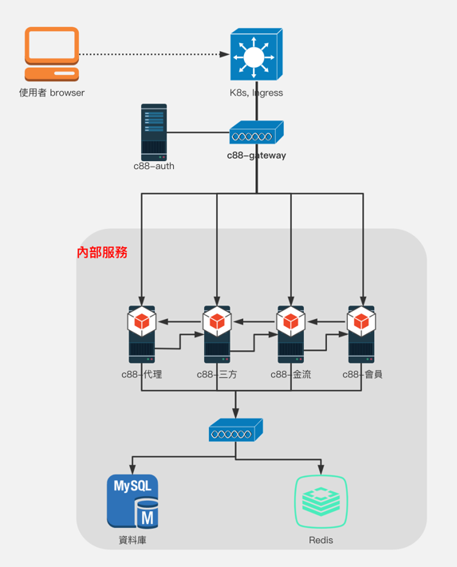

## 專案簡介

基於Spring Boot 2.6、Spring Cloud Kubernetes 搭建的服務

## 服務介紹

| 服務               | 說明                             | 開發狀態         | 文檔                                                                               |
|------------------|--------------------------------|--------------|----------------------------------------------------------------------------------|
| c88-admin        | 後台服務相關                         | 開發中          |                                                                                  |
| c88-auth         | uua 登入服務相關 發token              | 開發中          |                                                                                  |
| c88-gateway      | 網關相關負責 路由管理                    | 開發中          |                                                                                  |
| c88-common       | 相關共用lib                        | 開發中          |                                                                                  |
| c88-member       | 會員用戶服務                         | 開發中          |                                                                                  |
| c88-game-adapter | 三方遊戲相關服務 (開啟遊戲, 撈注單, 三方遊戲金額轉帳) | 開發中（已完成:CMD) | [Link](https://smartclouds.atlassian.net/wiki/spaces/Javateam/pages/216662017/-) |
| c88-payment      | 三方金流相關服務                       | 開發中          | [Link](https://smartclouds.atlassian.net/wiki/spaces/Javateam/pages/208371713/-)                                                                         |
| c88-affiliate    | 代理相關服務                         | 未開發          |                                                                                  |

## 其他相關服务

**🔴 排程中心**

- XXL-JOB-ADMIN （透過排程中心撈取注單） [gitLib專案在此](https://gitlab.hygo.cc/c88/backend/xxl-job-admin)
- 帳密: admin/123456 [dev環境在此-需要vpn](http://dev-c88-internal.hyu.tw/xxl-job-admin)

### [架構圖](https://www.processon.com/view/link/62611422e0b34d072168dae6)



### [拓墣圖](https://www.processon.com/view/link/626b77d1e401fd1b24608e1b)



## 🚀 Getting started

**服務Local端 開發 環境變數參數配置**

-
    1. 使用 [kt-connect](https://github.com/alibaba/kt-connect/blob/master/README_CN.md) 執行: sudo ktctl --debug connect
       （可以視作為 本地與k8s環境的vpn
-
    2. 啟動 c88-gateway -使用 spring.profiles.active-> local (c88-gateway需要使用才能local 才能引導到本地 想測試的服務
-
    3. 啟動 預開發的服務 -使用 KUBERNETES_NAMESPACE=c88, -使用 spring.profiles.active-> k8s_local（須啟動kt-connect 可以直接調用k8s測試環境上的服務)
-
    4. 或者可以直接使用kt-connect exchange 輔助開發測試
-
    5. **k8s集群環境切換到本地使用**
```shell
ktctl exchange --namespace=<namespace> <目标服务名> --expose <本地端口>:<目标服务端口>
```

## DEV 環境 （以下為外網連線資訊-需要連vpn）

**Google Kubernetes Engine 切換集群**

    gcloud container clusters get-credentials dev-cluster --region=asia-northeast1 --project=dev-sports
    若無法執行, 請找SRE

**Mysql**

    url: jdbc:mysql://34.84.138.202:3306/c88?serverTimezone=GMT&useUnicode=true&characterEncoding=utf8&useSSL=false
    username: root
    password: Y7HJv8Pdd86RtQ92hbPbbhET

**Redis**

    host: dev-c88-internal.hyu.tw
    port: 6379
    password: 4c55365c-009b-477b-ae47-07f15947c164
    database: 0

**RabbitMq**

    host:c88-rabbitmq
    port:5672
    http://dev-c88-internal.hyu.tw/rabbitmq/

## 💡備註

此 C88-parent pom.xml控制子專案的目錄與dependencies版本\
子專案間除了c88-common外，其餘專案是平行的service，不相互引用\
部署後透過http api 呼叫.

## clone submodule

`sh InitC88Project.sh
`

## package

`mvn clean package

# kt connect dev forword local

ktctl --namespace=c88 exchange c88-member --expose 8080:8080  